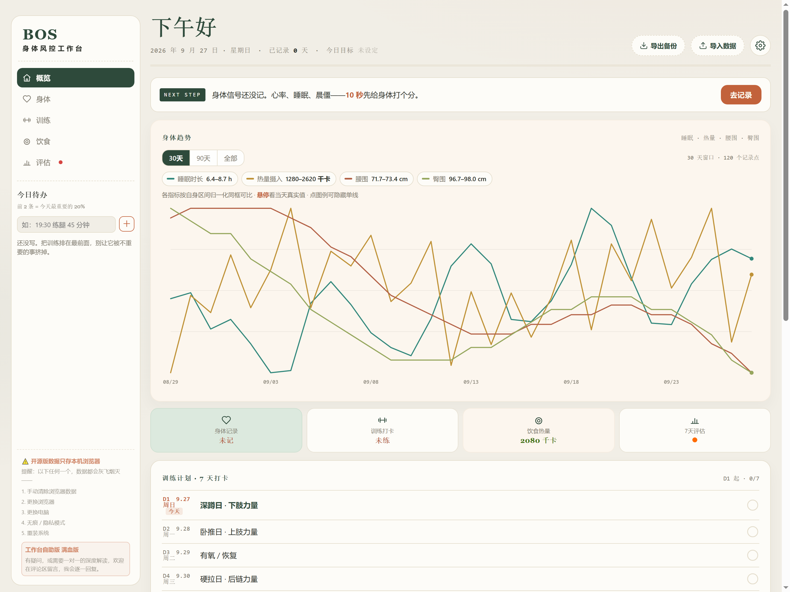
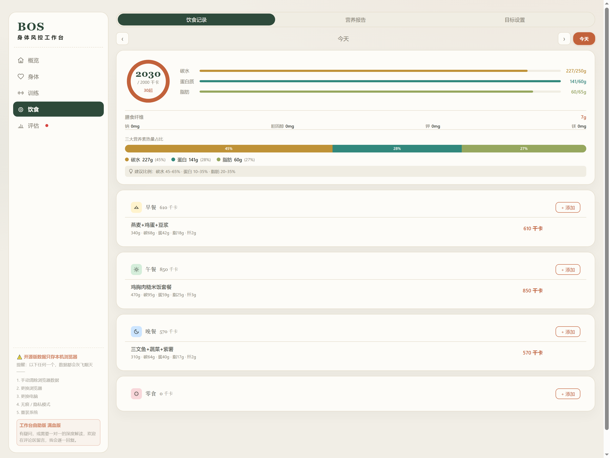
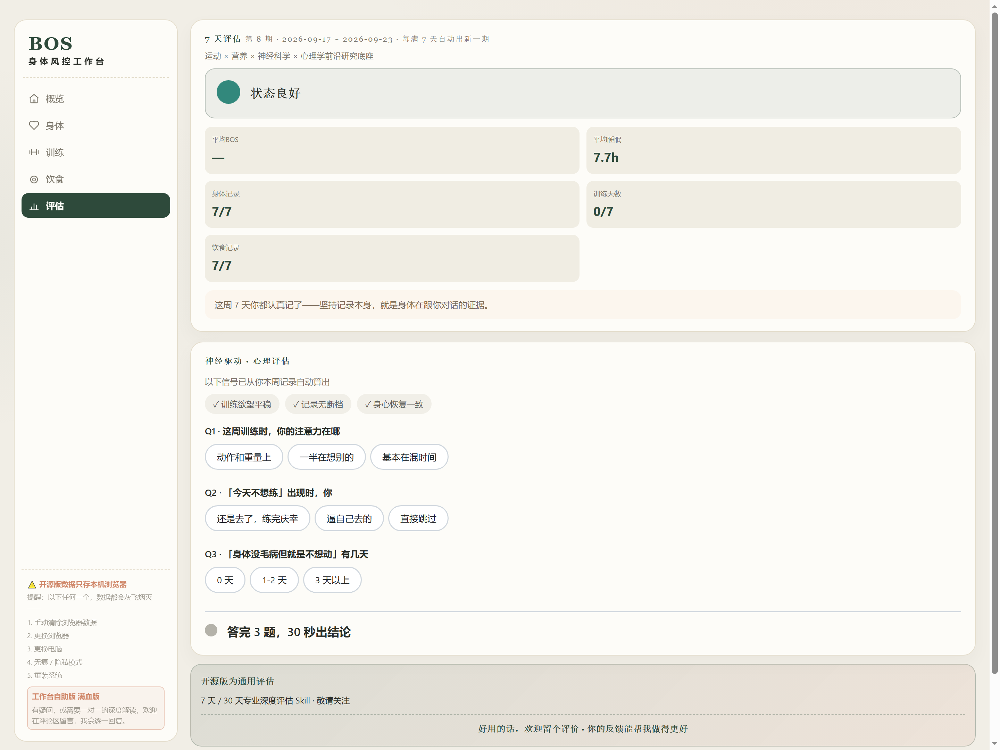

# BOS 身体风控工作台（开源版）

> 把一位 10 年教龄力量训练师的私教级身体风控系统，做成人人可开的单文件网页工具。
> 力量训练 × 神经科学 · K哥（赛博教练）
> 如果这个 Skill 帮到了你，欢迎在 GitHub 上留个评价，你的反馈能帮我做得更好。



## 这是什么

一个**零后端、零依赖、浏览器双击即开**的身体记录工作台。不注册、不联网、不上传，数据全在你自己的浏览器里。

| 页面 | 你能做什么 |
|------|-----------|
| 🏠 概览 | 睡眠 / 热量 / 腰围 / 臀围**四线趋势同屏** · 今日待办（前 2 条自动高亮）· 习惯打卡 · 训练计划 7 天打卡 |
| 💓 身体 | 心率 · 握力 · 睡眠时长与质量 · 晨起状态 · 进食窗口 · 经期锚点 · 腰臀比 WHR（附健康风险提示） |
| 🏋️ 训练 | 粘贴一行 `深蹲 80x5x5` 自动解析成计划 · 四套模板 · 逐组打卡 · 自动算今日训练容量 |
| 🥗 饮食 | 1189 种中国食物库 · 4 餐 · 23 项营养素 · BMR / TDEE 预设 · 周报与 30 天报告 |
| 📊 评估 | 7 天评估（🟢🟡🔴）· 神经驱动心理评估（3 题 30 秒出结论） |

## 30 秒上手

1. 下载 `assets/` 里的 `bos-tracker.html`（**单文件，食物库已内置，不需要其它文件**）
2. 双击打开
3. 开始记录

首次打开会自动填入 60 天演示数据，趋势图、报告、评估立刻能看到完整效果。想正式开始：到**评估页最底部 →「清空全部数据 · 恢复出厂」**，一键回到干净版本。

支持 Windows / macOS / Linux / 安卓 / iOS 文件 App。

## 数据在哪，会不会丢

数据存在浏览器的 `localStorage`，**不上传任何服务器**。

代价是：清浏览器数据、换浏览器、换电脑、无痕模式、重装系统——数据会没。

所以首页右上角有「⬇ 导出备份 / ⬆ 导入数据」。用 Chrome 或 Edge 时，点一次导出、自己选个文件夹，**之后每次记录都会自动写入那个文件**，换电脑导入即可恢复。

## 食饮页长这样



## 评估页长这样



## 装进 AI 里用

这个仓库同时是一个 Skill。装到 WorkBuddy、豆包这类 AI 工具里，你可以直接说「帮我记今天的睡眠」「把上周训练数据整理一下」，AI 会按 `SKILL.md` 帮你操作页面、处理备份 JSON、做数据自动化。

## 进阶

| | 内容 |
|---|---|
| 开源版 | 记录 + 通用 7 天评估 + 轻量心理评估（就是这个） |
| 个人评估 ¥99/月 | 每周 1 次，一对一个性化系统化训练营养指导 |

联系 **K哥**：微信 `kycilia`（注明来意）· 抖音搜「K哥（赛博教练）」

## 目录结构

```
.
├── README.md
├── CHANGELOG.md           更新说明
├── SKILL.md              AI 操作手册（装进 AI 工具后读这份）
├── LICENSE.md
└── assets/
    └── bos-tracker.html  唯一文件，双击打开（食物库已内置）
```

## 协议

[非商业许可](LICENSE.md) — 个人使用、学习、修改、非商业分享自由；**禁止商业使用与转售**。商业授权联系作者。

本工具输出的是通用评估，不构成医疗建议。
